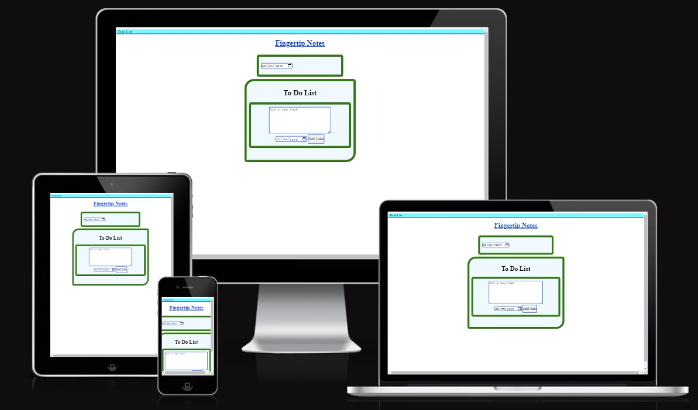
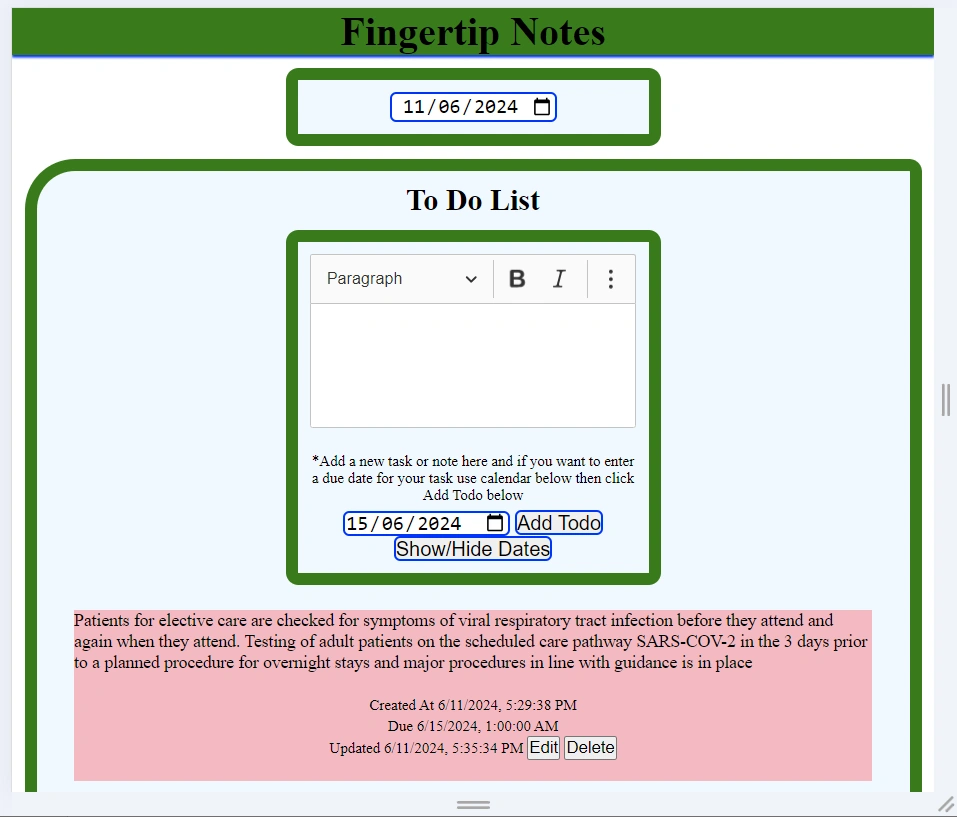
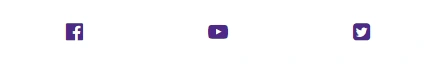

# Fingertip Notes

[View Website](https://rusjamison.github.io/fingertip-notes/  "Fingertip Notes")

Fingertip Notes is the site which helps and encourages the public to store their to do list, notes, grocery lists. It is tailor made to allow the public to store other data they might require in the future.

Momentarily forgetting why you walked into a room or struggling to find the right word are common experiences for many people—and they’re usually nothing to worry about.

As we age though, we may wonder whether these memory lapses signal a more significant health issue. When should you be concerned about memory loss?

This site will not address the medical side of memory loss but gives the public the tool they can use not to forget some important events or tasks up coming in their lives.

Technology is on our side, while there are lot of To Do applications on the market they don't address the issue of update and due date.

- We are the most fortunate and informed habitants to live on planet earth who can interact with technology.

- Integrated Circuits (IC) technology has improved greatly over the past ten years, making data storage easier, smarter, reliable and easy to retrive.

To minimize unnecessary forgetting important tasks and information this site assist the public to record their notes and retrive them anywhere they are. Engineers, Medical staff and Scientists will have special option to populate their notes/to do lists. 

## Table of Contents

* [User Experience](#user-experience)
* [Features](#features)
* [FutureFeatures](#future-features)
* [Deployment](#deployment)
* [Testing](#testing)
* [Technologies Used](#technologies-used)
* [Credits](#credits)

## User Experience

### User Stories

* #### First Time Visitor Goals
    * As a First Time Visitor, I want to see what can I benefit from the website
    * As a First Time Visitor, I want to navigate throughout the site easily
    * As a First Time Visitor, I want to find short, reliable and accurate information
    * As a First Time Visitor, I want to learn how to use the website quickly
    * As a First Time Visitor, I want to be able to apply what the site offer

* #### Returning visitor Goals
    * As a returning Visitor, I want to find more helpful information
    * As a returning Visitor, I want to find how I can interact with the site to full maximise its purpose.
    * As a returning Visitor, I want to view other new options added to the fingertip notes..
    * As a returning Visitor, I want to view helpful prompts and alerts when adding or updating tasks.
    * As a returning Visitor, I want to view latest capturing of my data using little effort on my part ie voice commands.

* ### Frequent Visitor Goals
    * As a Frequent Visitor, I want to see more and new data capturing methods.
    * As a Frequent Visitor, I want to see new additions which benefit the users.

    ### Existing Features

    * The Landing Page display area

    * The landing display includes the tasks textarea, the current date, the due date and To Do submit button.
    * The task textarea allows the user to entre the to do task or notes or grocery list or whatever the user want to remember later.
    * The textarea needs to be filled before a To Do button is clicked otherwise the user gets alert "Please add a Task".

    

    * The user decides on a task to accomplish.
        * The user enters the task or notes on the textarea.
        * The user has access to a calendar at the top to quickly decide when to accomplish a task.
        * The user then clicks on the date beside the To Do textarea to enter the Due date the user want to accomplish the task. The user has option to leave the Due date if he does not want a reminder.
        * When the Due date is up the To Do task changes color to alert the user.
        * The user has two options to carry the task or use Edit to update the task.
        * The user can keep the task in the local storage or delete it after the task is completed.
        * The user can edit the note or task many times but the last updated date is stamped under the notes.
        * Each task or note has a created date at the bottom.
        * If Edit is carried on the note or task it will also have updated date at the bottom of each note or task.
        * If user enter a Due date the Due date also appears at the bottom.

    * The Footer
       * The Footer appears at the buttom with easy movement from landing page to the social media link in the event the user want to quickly check something before adding a task or after adding the task
       * The Footer is very important to the users as it encourage to keep them connected and take away some stresses which contribute to memory loss.

      

      ### Future Features

* Fingertip Notes
    * Apart from helping with day to day task, the To Do created date, updated date and due date improve productivity.
    * This To Do list will have extra features in the future.
    * The current version because of the time factor to complete it might look crowded with the date stamps.
    * In the future appart from everyone can use it, it will come with special prepopulated option for engineers, medical staff and scientists so that they can easily add quick notes for their work.

    * For families the website will allow them to have common grocery list they can all update live at the same time. When one family member buys items the other members can see that like. There is no need for family members to buy bread or milk at the same time.
    * 
    * 

## Deployment

    Open your repositories on GitHub
    Select fingertip notes

    Select settings
    Select Pages

    Make sure source is Deploy from Branch

    Select main for branch and folder for root then click save

    Your site lives at https://rusjamison.github.io/fingertip-notes/

### Run Project Locally
    
    Clone project into Gitpod
        GitHub account. [Create GitHub Account](https://github.com)
    
    1. Install [Gitpod Extension for Chrome](https://gitpod.io/docs/browser-extension/)
    2. Use your Gitpod account to [Log into Gitpod](https://gitpod.io)
    3. [Health Check project repository](https://github.com/RusJamison/fingertip-notes.git)
    4. Create gitpod workspace.
        Click the "Code" button to the right of the screen, click HTTPs and copy the link there
        Open a GitBash terminal and navigate to the directory where you want to locate the clone
        On the command line, type "git clone" then paste in the copied url and press the Enter key to begin the clone process

    
    

## Testing

### Browser Compatibility

* Testing carried on these browsers
    * Chrome
    * Edge
    * Android

* Feature Testing

